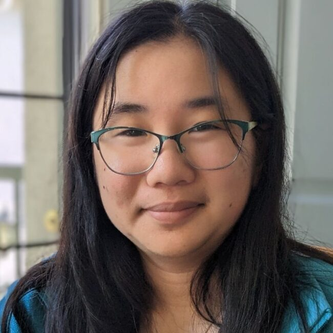

# Faith Okamoto

Personal website for Faith Aing Okamoto, ORCiD [0009-0007-4163-6928](https://orcid.org/0009-0007-4163-6928). Contact email: first initial + last name @ ucsc.edu

## About me

Hello there! I'm a bioinformatics grad student fascinated by the beauty of algorithms. At UC Santa Cruz, I'm excited to explore methods to detect and genotype structural variation.  Structural variants are often much more potent than easy-to-genotype variants, e.g. single nucleotide polymorphisms, SNPs. Yet, standard genetic analyses use SNPs because of how easily, cheaply, and accurately they can be genotyped at scale. I want to change that. I want to make using structural variants common practice. I believe we're on the brink of a genomics revolution and I want to be a part of it.

We can't use what we can't see. There's a classic story of a person looking for their keys under a street-lamp because the light is brightest. In this case, we're looking for genetic signals in SNPs because they're the easiest to see. My goal is to turn on the sun.

## Publications

- Okamoto *et al.* 2023. Y and Mitochondrial Chromosomes in the Heterogeneous Stock Rat Population. doi:[10.1101/2023.11.29.566473](https://doi.org/10.1101/2023.11.29.566473) bioRxiv. [Preprint; in peer review]

## Awards

- [**Regents Fellowship**](https://graddiv.ucsc.edu/financial-aid/): Stipend awarded to a limited number of first-year UCSC graduate students

- [**Gabriele Wienhausen Biological Science Scholarship**](https://biology.ucsd.edu/education/undergrad/research/scholarships/wienhausen.html): One-year award for a single UCSD biology student with demonstrated commitment to extracurricular research

## Work experience

- **Student research assistant, [Palmer Lab](https://palmerlab.org/)** (September 2022—August 2024)
- **NREIP intern, [Naval Environmental Preventative Medicine Unit 5](https://www.med.navy.mil/Navy-and-Marine-Corps-Force-Health-Protection-Command/Field-Activities/Navy-Environmental-Preventive-Medicine-Unit-5/)** (June 2022—August 2022)
- **Freelance tutor, [Wyzant](https://www.wyzant.com/match/tutor/88491196)** (July 2021—present)

## Education

### PhD, Biomolecular Engineering & Bioinformatics

*University of California, Santa Cruz (2024—present)*

Incoming student.

### BS, Biology with a Specialization in Bioinformatics

*University of California, San Diego (2021—2024)*

Graduated *summa cum laude*. Performed extracurricular research in [Dr. Abraham Palmer's lab](https://palmerlab.org/), culminating in the paper "Y and Mitochondrial Chromosomes in the Heterogeneous Stock Rat Population". Participated in the [Undergraduate Bioinformatics Club](https://ubicucsd.github.io/).

Credit for two-column layout: Matt Bierner, "Responsive, Two Column Documentation Layout With Markdown and CSS", https://mattbierner.github.io/markdown-two-column-documentation-example/